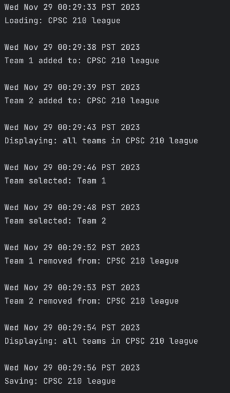
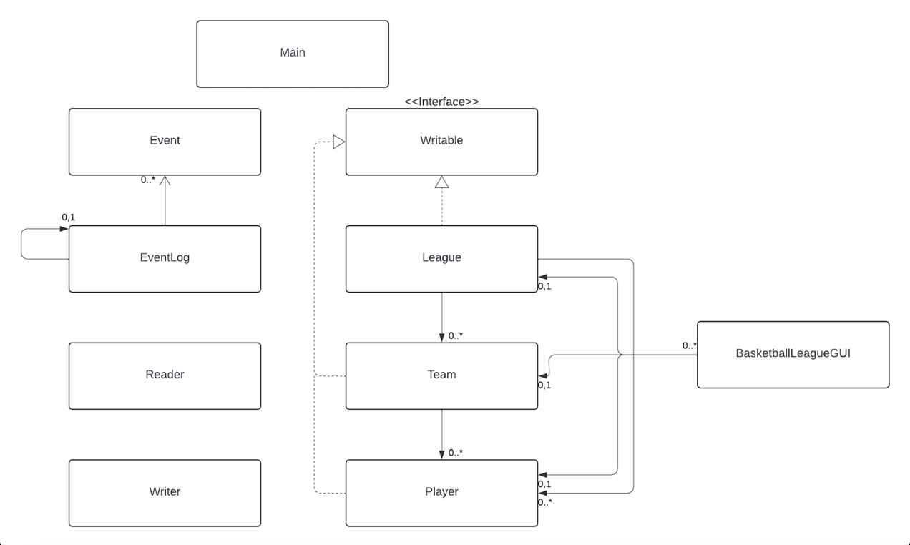

# Basketball League Stat Tracker

This basketball league tracker will allow people to keep track of their own
organized basketball league. Whether you're a player, coach, or even a fan,
this app gives basketball fans all around the world a way to manage their own
league and interact with the sport in a whole new way.

#### What will the application do?
* Keep track of the rosters of each team
* Keep track of teams in the league
* Display statistics such as points, rebounds, and assists after each completed game
* Keep track of each team's record

#### Who will use it?
* This app is designed for casual basketball leagues and players such as intramurals, local rec leagues, basketball 
camps, etc.

#### Why is this project of interest to you?

Basketball has surrounded me my whole entire life, whether that was as a player or a fan, I have always been 
connected to the sport. When competing in casual leagues in school and out of school, I always dreamt of having a way
to keep track of not only my own stats, but those on other teams as well. With this project, I hope to combine my love
for the game of basketball and my passion in computer science in hopes of creating something that is of use to players
with the same love for the sport as me.
## User Stories
* As a user, I want to be able to add a team to a league
* As a user, I want to be able to add players to a chosen team
* As a user, I want to be able to view a list of players on a team
* As a user, I want to be able to view a list of teams in a league
* As a user, I want to be able to assign statistics such as points, rebounds, and assists, to a player
* As a user, I want to be able to assign wins and losses to a team
* As a user, I want to be able to view the statistics of each player
* As a user, I want to be able to create a player
* As a user, I want to be able to save the state of the league including teams, players, stats, etc. in the menu
* As a user, I want to be able to load the league from file in the menu from the state it was left at

# Instructions for Grader
To get out of the start menu of the application you must click the start button and enter a league name first. 
After clicking the submit button:
* You can generate the first required action related to the user story "adding multiple Xs to a Y" by clicking the add
team button, typing in the team name and submitting, this will add the team to the league
* You can generate the second required action related to the user story "adding multiple Xs to a Y" by clicking the
remove team button, typing in the team name and submitting, this will remove the team from the league
* You can find the panel in which all the Xs that have already been added to Ys are displayed by clicking the view teams
button. This button must be clicked each time you add or remove a team to display the most current teams in the league
* You can locate my visual component by running the GUI, as the background of the start menu is a jpeg image of a 
basketball court
* You can save the state of my application in the start menu by clicking save. If you are in the league menu you may 
click main menu button to go back to the start menu and then click save. If you are in the team menu you may click the 
back button and then the main menu button to go back to the start menu then click save to save the state of my 
application.
* You can load the state of my application in the start menu by clicking load. If you are in the league menu you may
click main menu button to go back to the start menu and then click load. If you are in the team menu you may click the
back button and then the main menu button to go back to the start menu then click load to save the state of my
application.

Other miscellaneous instructions:
* The end season button must not be pressed unless at least two players which both must be on different teams (not on 
the injury reserve) and their stats have been edited
* When adding a player:
  * Name must be inputted as a string
  * Jersey number must be inputted as an int
  * Height must be inputted as an int
  * Weight must be inputted as a double
* When editing a team record:
  * Wins must be inputted as an int
  * Losses must be inputted as an int
* When adding a team, adding a player, adding a player to the injury reserve, removing a team, removing a player, 
editing player stats, or editing team records, in order to view the most recent changes you must click view teams or
view players as these do not auto update
* In order to add players to a team you must click the select team button
* In order to change a players stats you must be in the team menu and click the select player button
* In order to change a teams record you must be in the team menu and click the edit team record button
* In order to view all players on the injury reserve you must click the view injury reserve button inside the team menu
* In order to view all players who are not injured you must click the view players button inside the team menu
* In order to remove a player you must click the remove player button inside the team menu
* In order to add a player you must click the add player button inside the team menu
# Phase 4:

### Phase 4: Task 2
Sample of log events in BasketballLeagueGUI

### Phase 4: Task 3
UML Class Diagram

#### Refactoring Possibilities:
In my current UML diagram, although the design seems simple, there are many different refactoring 
possibilities. One thing that my design suffers from is a lack of cohesion. Currently, there are three main classes 
which create the core of my application, those being League, Team, and Player. These three classes do not follow the
single responsibility principle very well. For example, in my player class, I have various methods which do calculations
for the player such as calculating their average points, rebounds, assists, etc. However, in order to increase
cohesion, I should have made a separate class that does all the calculations and stat related stuff. This also goes for
all the statistic calculations in League and Team such as calculating the MVP, DPOY, league winner, team mvp, etc.
Furthermore, this extends to my GUI class which there were certain methods that should have been removed from that class
and added into another. For example, my GUI has a method which selects a team, this could easily be moved into the team
class which would have highly improved the cohesion in my GUI. Additionally, my GUI had many repetitive methods when I
would create things such as league menu, team menu, and player menu. This made for a lot of duplicated code and a lot of
fields which is evident in my GUI class. These are the biggest refactoring possibility present in my
current design and would have greatly improved the cohesion in my design. By doing this refactoring, my design would
follow the single responsibility principle.

# Basketball-League-App
